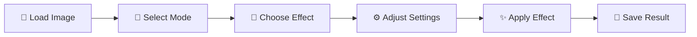

<div align="center">

# 🔐 DotScramble

### Advanced Image Privacy Studio Pro

<p align="center">
  
  
  
  
</p>

<p align="center">
  <strong>A powerful, modular image privacy protection tool with advanced features including face detection, multiple effect types, batch processing, and real-time preview.</strong>
</p>

<p align="center">
  <a href="#-quick-start">Quick Start</a> •
  <a href="#-features">Features</a> •
  <a href="#-usage">Usage</a> •
  <a href="#-installation">Installation</a> •
  <a href="#-contributing">Contributing</a>
</p>

</div>

---

## 🚀 Quick Start

> **No Python installation required!** Download and run the standalone executable.

<table>
<tr>
<td width="33%" align="center">

### 🪟 Windows

1. Download `DotScramble-windows.exe`
2. Double-click to launch
3. If SmartScreen appears, click **"More info"** → **"Run anyway"**

</td>
<td width="33%" align="center">

### 🐧 Linux

1. **Install System Dependencies** (for text detection features):
   ```bash
   sudo apt install tesseract-ocr tesseract-ocr-eng
   ```

2. Download `DotScramble-linux`
3. Make executable:
   ```bash
   chmod +x DotScramble-linux
   ```
4. Run: `./DotScramble-linux`

**Note:** Text detection features require Tesseract OCR. Without it, you'll see a warning but all other features work normally.


</td>
<td width="33%" align="center">

### 🍎 macOS

1. Download `DotScramble-macos`
2. Make executable:
   ```bash
   chmod +x DotScramble-macos
   ```
3. Right-click → **Open** to bypass Gatekeeper

</td>
</tr>
</table>

<div align="center">

**[�� Download Latest Release](https://github.com/kareem2099/DotScramble/releases/latest)**

</div>

---

## ✨ Features

<table>
<tr>
<td width="50%">

### 🎯 Detection Modes

- 🎭 **Face Detection** - Automatically detect and blur faces
- 👁️ **Eye Detection** - Target specific eye regions
- 🧍 **Full Body Detection** - Detect entire person silhouettes
- 🚗 **License Plate Detection** - Auto-identify vehicle plates
- 📝 **Text Detection (OCR)** - Find and censor text
- ✏️ **Manual Selection** - Draw custom regions
- 🌍 **Full Image** - Apply effects to entire image

</td>
<td width="50%">

### 🎨 Privacy Effects

- 🌫️ **Gaussian Blur** - Smooth, professional blur
- 🔲 **Pixelation** - Classic pixel censoring
- ⬛ **Black Bar** - Solid rectangular censor
- 🎭 **Gradient Fade** - Artistic gradient transition
- 🔳 **Mosaic** - Decorative tile pattern
- ❄️ **Frosted Glass** - Translucent glass effect
- 🎨 **Oil Paint** - Artistic painting style

</td>
</tr>
</table>

### 💎 Advanced Capabilities

<div align="center">

| Feature | Description |
|---------|-------------|
| ⚡ **Real-time Preview** | See effects instantly as you adjust parameters |
| 📦 **Batch Processing** | Process hundreds of images automatically |
| ↶↷ **Undo/Redo** | Full history management with keyboard shortcuts |
| 💾 **Presets System** | Save and load your favorite effect configurations |
| 🔍 **Comparison View** | Side-by-side before/after comparison |
| ⌨️ **Keyboard Shortcuts** | Lightning-fast workflow with hotkeys |
| 🎚️ **Opacity Control** | Blend effects with original image |
| 📊 **Image Information** | Display detailed image metadata |
| 🔄 **Smart Auto-Update** | Updates silently in the background without interrupting your work |
</div>

---

## 📖 Usage

### Basic Workflow



<details>
<summary><b>📷 Manual Selection Mode</b></summary>

1. Select **"✏️ Manual Selection"** from detection modes
2. Click and drag on the image to draw rectangles
3. Create multiple regions as needed
4. Click **"✨ Apply Effect"** to process all selected areas
5. Use **"🗑️ Clear Selections"** to reset and start over

</details>

<details>
<summary><b>⚡ Real-time Preview</b></summary>

1. Enable the **"🔴 Real-time Preview"** checkbox
2. Adjust any parameter (blur strength, opacity, etc.)
3. See results instantly without applying
4. Perfect for finding the ideal settings before committing

</details>

<details>
<summary><b>📦 Batch Processing</b></summary>

1. Click **"📦 Batch Process"** or press `Ctrl+B`
2. Select multiple images from your folders
3. Choose output directory for processed images
4. Configure detection mode and effect settings
5. Click **Start** and let it run automatically

</details>

<details>
<summary><b>💾 Presets Management</b></summary>

1. Configure your perfect settings (effect, strength, opacity, etc.)
2. Go to **Menu → Presets → Save Current Settings**
3. Name your preset (e.g., "Face Blur Strong", "Plate Pixelate")
4. Load anytime for consistent, repeatable results

</details>

---

## ⌨️ Keyboard Shortcuts

<div align="center">

| Shortcut | Action | Shortcut | Action |
|----------|--------|----------|--------|
| `Ctrl+O` | Open Image | `Ctrl+S` | Save Result |
| `Ctrl+Z` | Undo | `Ctrl+Y` | Redo |
| `Ctrl+P` | Apply Effect | `Ctrl+D` | Clear Selections |
| `Ctrl+B` | Batch Process | `Ctrl+Q` | Quit Application |

</div>

---

## 🎚️ Effect Parameters

<table>
<tr>
<td width="33%">

### 🌫️ Blur Strength
- **Range:** 15-199
- **Odd numbers only** for optimal results
- Higher values = stronger blur
- Recommended: 31-51 for faces

</td>
<td width="33%">

### 🔲 Pixel Block Size
- **Range:** 5-50 pixels
- Higher values = heavier censoring
- Lower values = subtle effect
- Recommended: 15-25 for balance

</td>
<td width="33%">

### 🎨 Opacity
- **Range:** 0-100%
- 100% = full effect applied
- Lower = blends with original
- Recommended: 80-100% for privacy

</td>
</tr>
</table>

---

## 🔍 Detection Tips

<details>
<summary><b>🎭 Face Detection</b></summary>

- ✅ Works best with front-facing faces
- ✅ Requires good lighting conditions
- ✅ Detects multiple faces in one image
- ⚠️ May miss faces at extreme angles or with heavy shadows
- 💡 **Tip:** Use Manual Selection as fallback for missed faces

</details>

<details>
<summary><b>🚗 License Plate Detection</b></summary>

- ✅ Optimized for standard license plate dimensions
- ✅ Works best with high-resolution images (1080p+)
- ✅ Filters by aspect ratio (2:1 to 5:1)
- ⚠️ May struggle with damaged or dirty plates
- 💡 **Tip:** Ensure plates are clearly visible and not at sharp angles

</details>

<details>
<summary><b>📝 Text Detection (OCR)</b></summary>

- ✅ Detects printed text in images
- ✅ Works best with high-contrast, clear text
- ✅ Adjustable confidence threshold
- ⚠️ Requires pytesseract installation
- 💡 **Tip:** Use on documents, signs, and screenshots

</details>

---

## 💻 Installation

### Option 1: Standalone Executable (Recommended)

**No dependencies required!** Simply download from the [Releases Page](https://github.com/kareem2099/DotScramble/releases/latest).

### Option 2: From Source

<details>
<summary><b>Click to expand installation steps</b></summary>

#### Prerequisites

- Python 3.6 or higher
- pip package manager

#### Steps

```bash
# Clone the repository
git clone https://github.com/kareem2099/DotScramble.git
cd DotScramble

# Install dependencies
pip install -r requirements.txt

# Run the application
python main.py
```

#### Dependencies

```bash
pip install opencv-python numpy Pillow pytesseract
```

</details>

---

## 📁 Project Structure

```
DotScramble/
│
├── 📄 main.py                   # Application entry point
├── ⚙️ config.py                 # Configuration & settings
├── 📋 requirements.txt          # Python dependencies
│
├── 🧠 core/
│   ├── image_processor.py      # Image processing & effects engine
│   ├── batch_processor.py      # Batch processing functionality
│   └── utils.py                # Utility functions & helpers
│
├── 🖼️ gui/
│   ├── main_window.py          # Main application window
│   └── batch_window.py         # Batch processing interface
│
├── 💾 presets.json             # Saved effect presets (auto-generated)
└── 🗂️ backups/                 # Automatic image backups (auto-created)
```

---

## 🛠️ Customization

### Adding Custom Effects

<details>
<summary><b>Click to see example code</b></summary>

1. Open `core/image_processor.py`
2. Add your effect method:

```python
@staticmethod
def my_custom_effect(image, x, y, w, h):
    """
    Apply custom effect to image region
    
    Args:
        image: Source image (numpy array)
        x, y: Top-left corner coordinates
        w, h: Width and height of region
    
    Returns:
        Processed region (numpy array)
    """
    region = image[y:y+h, x:x+w]
    
    # Your effect logic here
    # Example: Invert colors
    processed = 255 - region
    
    return processed
```

3. Update `config.py` EFFECTS dictionary:

```python
EFFECTS = {
    # ... existing effects ...
    'my_custom_effect': '🌟 My Custom Effect'
}
```

4. Add to GUI effect selection dropdown

</details>

---

## 🤝 Contributing

We welcome contributions! Here are some ideas to get started:

<table>
<tr>
<td>

### 🎯 Ideas for Contributors

- 🧠 Additional AI detection models
- 🎨 More creative effect types
- 🎥 Video processing support
- ⚡ GPU acceleration with CUDA
- 🌐 Web-based interface
- 📱 Mobile app version
- 🔄 Batch undo/redo
- 📊 Processing statistics

</td>
<td>

### 📝 How to Contribute

1. Fork the repository
2. Create your feature branch
   ```bash
   git checkout -b feature/AmazingFeature
   ```
3. Commit your changes
   ```bash
   git commit -m 'Add AmazingFeature'
   ```
4. Push to the branch
   ```bash
   git push origin feature/AmazingFeature
   ```
5. Open a Pull Request

</td>
</tr>
</table>

---

## 📄 License

This project is licensed under the **MIT License** - see the [LICENSE](LICENSE) file for details.

```
MIT License - Free for personal and commercial use
```

---

## 🙏 Acknowledgments

- **OpenCV** - Computer vision library
- **Python Community** - Amazing ecosystem
- **Contributors** - Everyone who has helped improve this project

---

## 📞 Support & Contact

<div align="center">

**Need Help?**

[](https://github.com/kareem2099/DotScramble/issues)
[](https://github.com/kareem2099/DotScramble/discussions)

</div>

### Troubleshooting

<details>
<summary><b>Common Issues</b></summary>

**Q: I see a Tesseract warning on Linux?**  
A: Text detection features require Tesseract OCR. Install it with:
```bash
sudo apt install tesseract-ocr tesseract-ocr-eng
```
After installation, restart the application to enable text detection features.

**Q:  detection not working?**  
A: Ensure good lighting and front-facing angles. Try adjusting detection sensitivity in settings.

**Q: Application won't start?**  
A: Check that all dependencies are installed. Try running from source with `python main.py`.

**Q: Batch processing is slow?**  
A: PA: Processing time depends on image size and effect complexity. Consider using pixelation for faster processing.

**Q: Can't save preset?**  
A: Ensure you have write permissions in the application directory.

</details>


<div align="center">

### ⭐ Star this repository if you find it helpful!

Made with ❤️ for privacy protection

**[⬆ Back to Top](#-dotscramble)**

</div>
