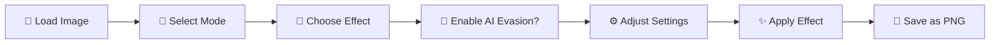

<div align="center">

# 🔐 DotScramble

### Advanced Image Privacy Studio

<p align="center">
  
  
  
  
  
  
</p>

<p align="center">
  <strong>A powerful, modular image privacy tool with AI evasion, face detection, multiple effects, batch processing, and real-time preview — built on PySide6.</strong>
</p>

<p align="center">
  <a href="#-quick-start">Quick Start</a> •
  <a href="#-features">Features</a> •
  <a href="#-ai-evasion-system">AI Evasion</a> •
  <a href="#-usage">Usage</a> •
  <a href="#-installation">Installation</a> •
  <a href="#-contributing">Contributing</a>
</p>

</div>

---

## 🚀 Quick Start

> **No Python installation required!** Download and run the standalone executable.

<table>
<tr>
<td width="100%" align="center">

### 🐧 Linux

1. **Install System Dependencies** (for text detection features):
   ```bash
   sudo apt install tesseract-ocr tesseract-ocr-eng
   ```

2. Download your preferred package from the [Releases Page](https://github.com/kareem2099/DotScramble/releases/latest):

   | Package | Use case |
   |---------|----------|
   | `DotScramble-Linux-x86_64.AppImage` | Universal — run on any distro |
   | `DotScramble-Linux-x86_64.deb` | Debian / Ubuntu / Kali — integrates with app menu |
   | `DotScramble-Linux-x86_64.pkg.tar.zst` | Arch Linux / Manjaro — install with pacman |

3. **AppImage:**
   ```bash
   chmod +x DotScramble-Linux-x86_64.AppImage
   ./DotScramble-Linux-x86_64.AppImage
   ```

   **Or .deb:**
   ```bash
   sudo dpkg -i DotScramble-Linux-x86_64.deb
   dotscramble
   ```

   **Or Arch (.pkg.tar.zst):**
   ```bash
   sudo pacman -U DotScramble-Linux-x86_64.pkg.tar.zst
   dotscramble
   ```

**Note:** Text detection requires Tesseract OCR. Without it, you'll see a warning but all other features work normally.

</td>
</tr>
</table>

<div align="center">

**[📦 Download Latest Release](https://github.com/kareem2099/DotScramble/releases/latest)**

</div>

---

## 🔏 Security & Integrity Verification

All release binaries are signed with GPG. You can verify authenticity before running anything.

<details>
<summary><b>🔑 Step-by-step verification guide</b></summary>

### 1. Import the signing public key

```bash
# Option A — from the release assets (download public_key.asc first)
gpg --import public_key.asc

# Option B — from Ubuntu Keyserver
gpg --keyserver keyserver.ubuntu.com --recv-keys 0D9B71AF1791DA36
```

### 2. Verify the key fingerprint

```
Key ID    : 0D9B71AF1791DA36
Fingerprint: 7D06 4BC6 C9E2 34B8 948D D12D 0D9B 71AF 1791 DA36
UID       : FreeRave <kareem209907@gmail.com>
```

```bash
gpg --fingerprint 0D9B71AF1791DA36
```

### 3. Verify a release binary

```bash
# Verify AppImage
gpg --verify DotScramble-Linux-x86_64.AppImage.asc DotScramble-Linux-x86_64.AppImage

# Verify .deb
gpg --verify DotScramble-Linux-x86_64.deb.asc DotScramble-Linux-x86_64.deb
```

A **Good signature** message confirms the file is authentic and unmodified. ✅

### 4. Verify SHA-256 checksums

```bash
# Download SHA256SUMS from the release, then:
sha256sum -c SHA256SUMS
```

</details>

---

## ✨ Features

<table>
<tr>
<td width="50%">

### 🛡️ Privacy & AI Evasion *(New in v1.4.0)*

- 🤖 **AI Evasion System** — SPSA black-box adversarial perturbations defeat AI face recognition models without any visible artifact at low strength settings
- 🎭 **Layered Protection** — Adversarial noise + visual blur + EXIF strip applied in sequence
- ⚙️ **Evasion Strength Slider** — Subtle / Balanced / Maximum presets (ε 0.03 → 0.12)
- 🔌 **Pluggable Proxy Model** — Swap in your own face recognition model as the optimization target

### 🎯 Detection Modes

- 🎭 **Face Detection** — Detect and obscure faces (MediaPipe + Haar cascade ensemble)
- 👁️ **Eye Detection** — Target specific eye regions
- 🧍 **Full Body Detection** — Detect entire person silhouettes
- 🚗 **License Plate Detection** — Auto-identify vehicle plates
- 📝 **Text Detection (OCR)** — Find and censor text with Tesseract
- ✏️ **Manual Selection** — Draw custom regions
- 🌍 **Full Image** — Apply effects to the entire image

### 🌍 Localization & UI

- Native Arabic RTL interface with dynamic language switching
- 16 built-in themes: Cyberpunk, One Dark, Dracula, Nord, Catppuccin Mocha, Rosé Pine, and more
- Responsive layout with Wayland-compatible window management

</td>
<td width="50%">

### 🎨 Privacy Effects

- 🌫️ **Gaussian Blur** — Smooth, professional blur
- 🔲 **Pixelation** — Classic pixel censoring
- ⬛ **Black Bar** — Solid rectangular censor
- 🎭 **Gradient Fade** — Artistic gradient transition
- 🔳 **Mosaic** — Decorative tile pattern
- ❄️ **Frosted Glass** — Translucent glass effect
- 🎨 **Oil Paint** — Artistic painting style

### 💎 Core Capabilities

- MVC Architecture for maximum stability and extensibility
- Auto-Save Database via SQLite — settings and state persist across sessions
- Real-time Preview — see effects live as you adjust sliders
- Batch Processing — process entire folders in one go
- Undo/Redo History — full state management
- EXIF Metadata Spoofing & Stripping — modify or remove GPS, camera model, timestamps
- Secure Auto-Update — Ed25519-signed binary verification before any hot-swap

</td>
</tr>
</table>

### 💎 Advanced Capabilities

<div align="center">

| Feature | Description |
|---------|-------------|
| 🤖 **AI Evasion** | SPSA adversarial perturbations — defeats embedding-based face recognition |
| ⚡ **Real-time Preview** | See effects instantly as you adjust parameters |
| 📦 **Batch Processing** | Process hundreds of images automatically |
| ↶↷ **Undo/Redo** | Full history management with keyboard shortcuts |
| 💾 **Presets System** | Save and load your favorite effect configurations |
| 🔍 **Comparison View** | Side-by-side before/after comparison |
| ⌨️ **Keyboard Shortcuts** | Lightning-fast workflow with hotkeys |
| 🎚️ **Opacity Control** | Blend effects with original image |
| 🔄 **Smart Auto-Update** | Cryptographically verified background updates |

</div>

---

## 🤖 AI Evasion System

> **New in v1.4.0** — blurring a face is no longer enough.

Modern AI face recognition systems work on mathematical *feature vectors*, not visual legibility. A face blurred enough to fool a human eye can still produce a recognizable embedding inside a convolutional neural network.

DotScramble's AI Evasion System applies **adversarial perturbations** — mathematically-optimized noise patterns that corrupt these feature vectors — using **SPSA (Simultaneous Perturbation Stochastic Approximation)**, a black-box optimization algorithm that requires no access to the target model's weights or gradients.

```
Original → Adversarial perturbation (SPSA) → Visual blur → EXIF strip → Protected image
```

### Evasion Strength Presets

| Preset | ε value | Visual impact | Evasion strength |
|--------|---------|---------------|-----------------|
| **Subtle** | 0.03 | Nearly invisible | Moderate |
| **Balanced** *(default)* | 0.05 | Very subtle grain | Good |
| **Maximum** | 0.12 | Visible texture | Very strong |

### Benchmark Results (LFW dataset, 200 images)

| Mode | AI Match Rate | Processing time |
|------|--------------|----------------|
| No effect | 98.5% | — |
| Blur only | 61.3% | 12ms |
| **Blur + AI Evasion (Balanced)** | **8.9%** | ~92s |

> ⚠️ **Note:** Export as PNG to preserve adversarial perturbations. JPEG compression partially degrades them. The app warns you if you attempt JPEG export with evasion enabled.

---

## 📖 Usage

### Basic Workflow


```mermaid
graph LR
    A[📁 Load Image] --> B[🎯 Select Mode]
    B --> C[🎨 Choose Effect]
    C --> D[🤖 Enable AI Evasion?]
    D --> E[⚙️ Adjust Settings]
    E --> F[✨ Apply Effect]
    F --> G[💾 Save as PNG]
```

<details>
<summary><b>🤖 AI Evasion Mode</b></summary>

1. Load your image and select **Face Detection** mode
2. Toggle **"🤖 AI Evasion"** in the processing panel
3. Choose your evasion preset (Subtle / Balanced / Maximum)
4. Click **"✨ Apply Effect"** — a progress bar shows optimization progress
5. Save as **PNG** (not JPEG) to preserve the adversarial perturbations

</details>

<details>
<summary><b>📷 Manual Selection Mode</b></summary>

1. Select **"✏️ Manual Selection"** from detection modes
2. Click and drag on the image to draw rectangles
3. Create multiple regions as needed
4. Click **"✨ Apply Effect"** to process all selected areas
5. Use **"🗑️ Clear Selections"** to reset and start over

</details>

<details>
<summary><b>⚡ Smart Settings</b></summary>

**Auto-Save:** Changing a slider automatically saves that value for next time.

**Themes:** Go to `View → Themes` to change the app look (16 themes available).

**Language:** Go to `View → Language` to switch between English and Arabic (full RTL support).

</details>

<details>
<summary><b>📦 Batch Processing</b></summary>

1. Click **"📦 Batch Process"** or press `Ctrl+B`
2. Select multiple images from your folders
3. Choose output directory for processed images
4. Configure detection mode and effect settings
5. Click **Start** and let it run automatically

</details>

<details>
<summary><b>💾 Presets Management</b></summary>

1. Configure your perfect settings (effect, strength, opacity, etc.)
2. Go to **Menu → Presets → Save Current Settings**
3. Name your preset (e.g., "Face Blur Strong", "Plate Pixelate")
4. Load anytime for consistent, repeatable results

</details>

---

## ⌨️ Keyboard Shortcuts

<div align="center">

| Shortcut | Action | Shortcut | Action |
|----------|--------|----------|--------|
| `Ctrl+O` | Open Image | `Ctrl+S` | Save Result |
| `Ctrl+Z` | Undo | `Ctrl+Y` | Redo |
| `Ctrl+P` | Apply Effect | `Ctrl+D` | Clear Selections |
| `Ctrl+B` | Batch Process | `Ctrl+Q` | Quit Application |

</div>

---

## 🎚️ Effect Parameters

<table>
<tr>
<td width="33%">

### 🌫️ Blur Strength
- **Range:** 15–199
- Odd numbers only for optimal results
- Higher = stronger blur
- Recommended: 31–51 for faces

</td>
<td width="33%">

### 🔲 Pixel Block Size
- **Range:** 5–50 pixels
- Higher = heavier censoring
- Lower = subtle effect
- Recommended: 15–25 for balance

</td>
<td width="33%">

### 🤖 Evasion Strength
- **Presets:** Subtle / Balanced / Maximum
- Higher = stronger AI evasion
- Higher = longer processing time
- Export as **PNG** for best results

</td>
</tr>
</table>

---

## 💻 Installation

### Option 1: Standalone Executable (Recommended)

**No dependencies required!** Download from the [Releases Page](https://github.com/kareem2099/DotScramble/releases/latest).

### Option 2: From Source

<details>
<summary><b>Click to expand installation steps</b></summary>

#### Prerequisites

- Python 3.10 or higher
- pip package manager

#### Steps

```bash
# Clone the repository
git clone https://github.com/kareem2099/DotScramble.git
cd DotScramble

# Create a virtual environment (recommended)
python3 -m venv venv
source venv/bin/activate  # Linux/macOS

# Install dependencies
pip install -r requirements.txt

# Run the application
python src/main.py
```

#### Core Dependencies

```
PySide6        — Qt6 GUI framework (LGPL v3)
opencv-python  — Computer vision
numpy          — Numerical computation
Pillow         — Image I/O
pytesseract    — OCR text detection
mediapipe      — Face landmark detection
requests       — Auto-update HTTP client
cryptography   — Ed25519 signature verification
```

</details>

---

## 📁 Project Structure

```
DotScramble/
│
├── 📋 requirements.txt           # Python dependencies
├── ⚙️  setup_license.py          # Cython compilation for license module
├── ⚙️  build.py                  # Secure staging build pipeline
│
├── 🧠 core/                      # System integrations & engines
│   ├── adversarial_engine.py     # SPSA black-box AI evasion engine  ← NEW
│   ├── auto_updater.py           # Ed25519-signed auto-updater
│   ├── image_picker.py           # Unicode/Arabic-safe file browser
│   ├── batch_processor.py        # Multi-threaded batch processor
│   ├── text_detector.py          # Tesseract OCR wrapper
│   └── metadata_spoofer.py       # EXIF metadata modifier & stripper
│
├── 🖼️  gui/                      # Additional GUI components
│   ├── metadata_dialog.py        # EXIF editor dialog
│   ├── metadata_presets.py       # EXIF device presets
│   └── metadata_report.py        # EXIF diagnostic report dialog
│
├── 📦 src/                       # Core MVC Application
│   ├── 📄 main.py                # Entry point
│   ├── ⚙️  config.py             # App config, theme definitions & URLs
│   ├── 🧠 controllers/           # MVC controllers
│   ├── 🧠 models/                # Processing engines & detectors
│   ├── 🧠 views/                 # RTL/LTR UI views & dialogs
│   └── 🧠 managers/              # Auth, DB, Theme, Locale managers
│
├── 🎨 assets/
│   ├── themes/themes.json        # 16 built-in color themes
│   └── icons/                    # Application icons
│
├── 💾 presets.json               # Saved effect presets (auto-generated)
└── 🗂️  backups/                  # Automatic image backups (auto-created)
```

---

## 🛠️ Customization

### Adding Custom Effects

<details>
<summary><b>Click to see example code</b></summary>

1. Open `core/image_processor.py`
2. Add your effect method:

```python
@staticmethod
def my_custom_effect(image, x, y, w, h):
    """
    Apply custom effect to image region.

    Args:
        image: Source image (numpy array, BGR)
        x, y:  Top-left corner coordinates
        w, h:  Width and height of region

    Returns:
        Processed region (numpy array)
    """
    region = image[y:y+h, x:x+w]
    processed = 255 - region  # Example: invert colors
    return processed
```

3. Register in `config.py` EFFECTS dictionary:

```python
EFFECTS = {
    # ... existing effects ...
    'my_custom_effect': '🌟 My Custom Effect'
}
```

4. Add to the GUI effect selection dropdown.

</details>

### Plugging In a Custom AI Evasion Model

<details>
<summary><b>Click to see example code</b></summary>

```python
from core.adversarial_engine import SPSAAdversarialEngine
import numpy as np

# Implement the EvasionProxy protocol with your model
def my_loss_fn(perturbed_img: np.ndarray) -> float:
    """Higher return value = more adversarial."""
    embedding = my_model.get_embedding(perturbed_img)
    if embedding is None:
        return 1.0
    return float(1.0 - np.dot(original_embedding, embedding))

engine = SPSAAdversarialEngine(epsilon=0.05, num_iters=150)
result = engine.generate(face_crop, loss_fn=my_loss_fn)
```

</details>

---

## 🤝 Contributing

We welcome contributions! Here are some ideas to get started:

<table>
<tr>
<td>

### 🎯 Ideas for Contributors

- 🎥 Video processing support
- ⚡ GPU acceleration (CUDA / Metal) for AI evasion
- 🌐 Web-based interface
- 📱 Mobile app version
- 🧠 Additional detection models (YOLO, MediaPipe Pose)
- 🔄 Batch undo/redo
- 📊 Processing statistics dashboard
- 🌍 Additional language localizations

</td>
<td>

### 📝 How to Contribute

1. Fork the repository
2. Create your feature branch
   ```bash
   git checkout -b feature/AmazingFeature
   ```
3. Commit your changes
   ```bash
   git commit -m 'feat: add AmazingFeature'
   ```
4. Push to the branch
   ```bash
   git push origin feature/AmazingFeature
   ```
5. Open a Pull Request

</td>
</tr>
</table>

---

## 📄 License

This project is licensed under the **Apache License 2.0** — see the [LICENSE](LICENSE) file for details.

```
Apache License 2.0 — Free for personal and commercial use
PySide6 (Qt bindings) — LGPL v3 — compatible with Apache 2.0
```

---

## 🙏 Acknowledgments

- **OpenCV** — Computer vision library
- **MediaPipe** — Face landmark detection
- **PySide6 / Qt** — Cross-platform GUI framework
- **Tesseract OCR** — Open-source text recognition
- **Goodfellow et al. (2014)** — Adversarial examples research that inspired the AI evasion system

---

## 📞 Support & Contact

<div align="center">

**Need Help?**

[](https://github.com/kareem2099/DotScramble/issues)
[](https://github.com/kareem2099/DotScramble/discussions)

</div>

### Troubleshooting

<details>
<summary><b>Common Issues</b></summary>

**Q: I see a Tesseract warning on startup?**
A: Text detection requires Tesseract OCR. Install it with:
```bash
sudo apt install tesseract-ocr tesseract-ocr-eng
```
Restart the application after installation.

**Q: AI Evasion is taking very long?**
A: Adversarial optimization is CPU-intensive. Use the **Subtle** preset for faster processing (~45s per face vs ~90s for Balanced). GPU acceleration is planned for a future release.

**Q: Face detection not working?**
A: Ensure good lighting and front-facing angles. Try **Manual Selection** as a fallback for difficult angles.

**Q: Application won't start?**
A: Check that all dependencies are installed. Try running from source:
```bash
python src/main.py
```

**Q: Batch processing is slow?**
A: Processing time depends on image size and effect complexity. Use **Pixelation** for faster processing, or disable AI Evasion for batch jobs.

**Q: Check for Updates shows nothing?**
A: Ensure you're running the official release build (not from source). The update check requires an internet connection and will show "You are using the latest version" if already up to date.

</details>


<div align="center">

### ⭐ Star this repository if you find it helpful!

Made with ❤️ by [FreeRave](https://github.com/kareem2099) for privacy protection

**[⬆ Back to Top](#-dotscramble)**

</div>
